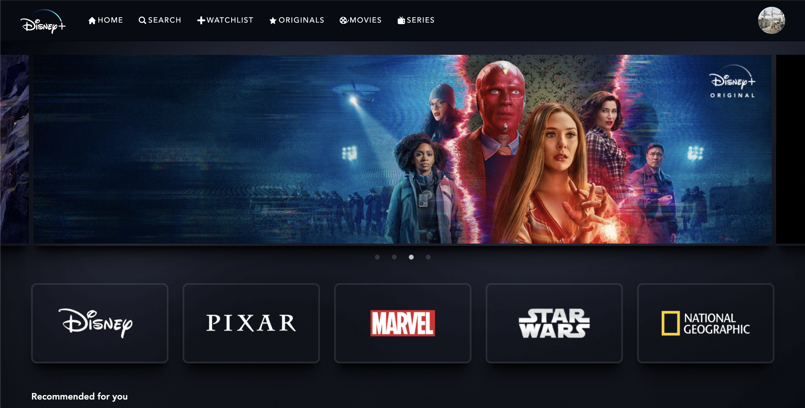

<h1 align="center">
    
</h1>

<h4 align="center"> 
	Disney+ Clone 🚀 
</h4>

<p align="center">
  <a href="#-project">Project</a>&nbsp;&nbsp;&nbsp;|&nbsp;&nbsp;&nbsp;
  <a href="#rocket-technologies">Technologies</a>&nbsp;&nbsp;&nbsp;|&nbsp;&nbsp;&nbsp;
  <a href="#-how-to-use">How to use</a>&nbsp;&nbsp;&nbsp;|&nbsp;&nbsp;&nbsp;
  <a href="#-how-to-contribute">How to contribute</a>&nbsp;&nbsp;&nbsp;|&nbsp;&nbsp;&nbsp;
  <a href="#memo-license">License</a>
</p>

<p align="center">
  
</p>

## 💻 Project

This is a simple Disney+ clone project which i used to improve my css and layout skills.

## :rocket: Technologies

This project was developed with the following technologies:

- [React][reactjs]
- [Redux][redux]
- [Firebase][firebase]

## :information_source: How To Use

To clone and run this application, you'll need [Git](https://git-scm.com) + [Yarn][yarn] installed on your computer.

From your command line:

### Install

```bash
# Clone this repository
$ git clone https://github.com/kevinnog/disney-plus-clone

# Go into the repository
$ cd disney-plus-clone/

# Install dependencies
$ yarn install

# Start project
$ yarn start
```

### Environment Variables

You will also need to create a .env file on the root of your project, and create the firebase variables as shown bellow:

```env
API_KEY=<appKey>,
AUTH_DOMAIN=<authDomain>,
PROJECT_ID=<projectId>,
STORAGE_BUCKET=<storageBucket>,
MESSAGING_SENDER_ID=<messagingSenderId>,
APP_ID=<appId>,
MEASUREMENT_ID=<measurementId>,
```

## 🤔 How to contribute

- Make a fork;
- Create a branch with your feature: `git checkout -b my-feature`;
- Commit changes: `git commit -m 'feat: My new feature'`;
- Make a push to your branch: `git push origin my-feature`.

After merging your receipt request to done, you can delete a branch from yours.

## :memo: License

This project is under the MIT license. See the [LICENSE](https://github.com/kevinnog/disney-plus-clone/blob/master/LICENSE) for details.

Made by Kevin Nogueira :wave: [Get in touch!](https://www.linkedin.com/in/kevin-nogueira-costa-403536104/)

[redux]: https://redux.js.org
[reactjs]: https://reactjs.org
[redux]: https://facebook.github.io/react-native/
[yarn]: https://yarnpkg.com/
[firebase]: https://firebase.google.com
